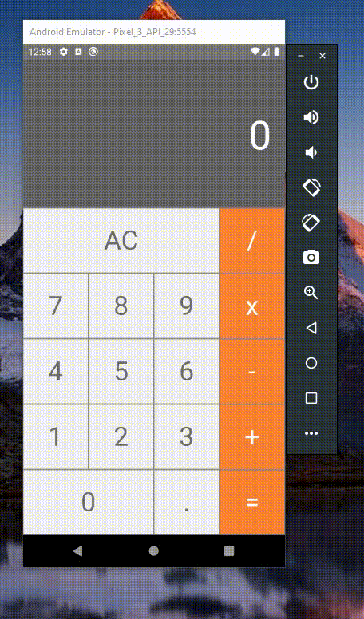

# Simple Calculator - React Native
 
## 📸 Preview

  

## 📝 **Descrição**

Aplicativo de calculadora desenvolvido usando React Native. Realiza um calculo por vez com operações simples. Foi testado em aparelhos físicos e virtuais Android e possui suporte para iOS.

## 🚀 **Objetivo**

Esse projeto foi criado com o objetivo de criar um aplicativo simples com as principais funções de uma calculadora (soma, subtração, multiplicação e divisão) baseada no software de calculadora padrão do MacOS. Só é possível visualizar 1 valor por vez no display armazenando as ações anteriores apenas em cache para realização dos cálculos.

## ✅ Features Funcionais
- Soma, Subtração, Multiplicação e Divisão de valores reais
- Suporte e tratamento de valores flutuantes
- Função "Clear" para limpar o cache de cálculos feitos.

## 👷 Features Futuras
- Exibir o calculo construído até o momento em tela
- Suporte a cálculos usando parênteses
- Suporte a cálculos usando % (porcentagem)
- Exibir histórico de Cálculos

## 🔎 Teste Você Mesmo
📌 **Pré requisitos:**
1. Tenha o repositório baixado em sua máquina.
2. Tenha o [NodeJS](https://nodejs.org/) instalado em sua máquina
3. Tenha o [React Native CLI](https://reactnative.dev/docs/environment-setup) instalado em sua máquina junto a um virtual device Android ou iOS.

🚩 **Como Executar:**
1. Para executar o projeto você deve seguir os passos mostrados na documentação do [React Native CLI](https://reactnative.dev/docs/environment-setup). Dependendo do seu sistema operacional e plataforma de execução você deve usar comandos diferentes.
2. Caso você queira testar no Windows usando um virtual device Android execute o comando: ` npx react-native run-android `. Em outro caso, consulte a documentação no item 1.

   

